# Deno Template

[](https://velociraptor.run)

Working on a base "best practices" template for my Deno projects

## Prerequisite

- Install [Deno][1]

## Run with the [Velociraptor][2] script runner

- Install [Velociraptor][2]
- restore cache from lock file

    ```bash
    vr restore-cache
    ```

- Run project (will run restore-cache first)

    ```bash
    vr start
    ```

## Run with WebStorm

While the Velociraptor runner is handy, if you use WebStorm it is probably more convenient
to use the built in `Run/Debug Configurations` functionality. Here is how to duplicate the
Velociraptor scripts in pure WebStorm:

1. Install the Deno plugin<br />
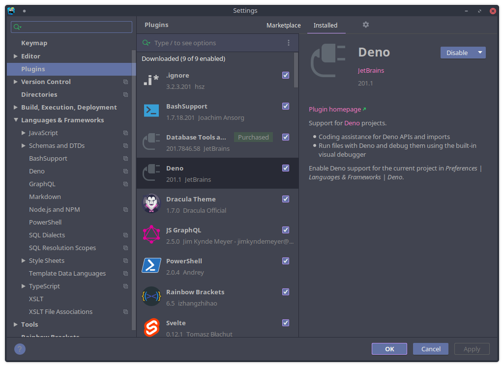

1. Activate Deno for the current project<br />
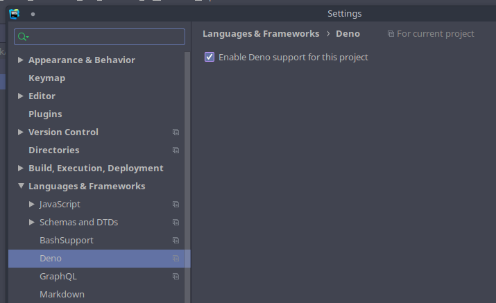

1. Open the configurations dialog from the toolbar<br />
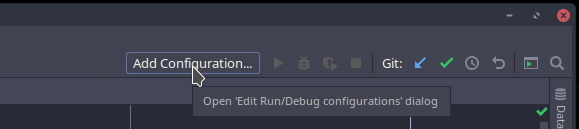

1. And click the plus (+) sign to pick a template for our new configuration<br />
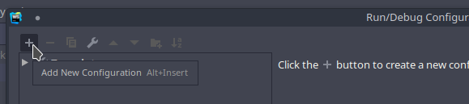

1. There should now be a Deno option that was installed by the plugin<br />
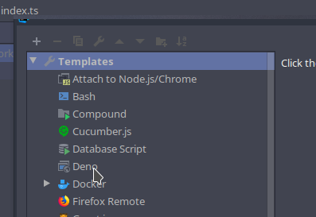

1. The default Deno template is set up for the ```deno run``` command and really only needs
you to tell it where to find the **main** file for the project (e.g. **index.ts**,
**server.ts**, etc.)<br />
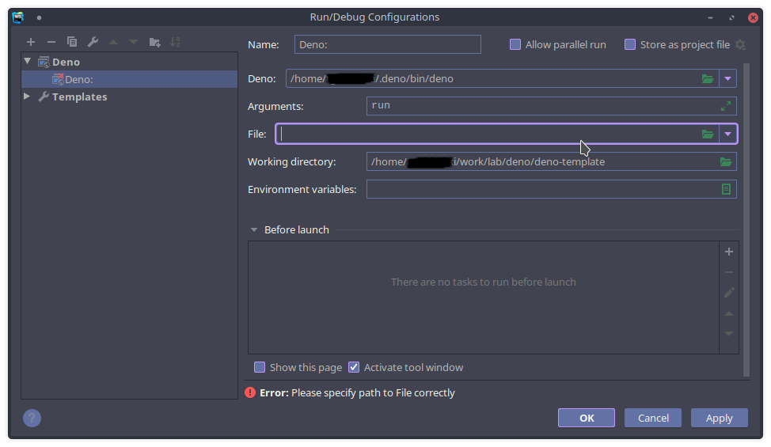

1. We can add some environment variables for Deno to pick up<br />
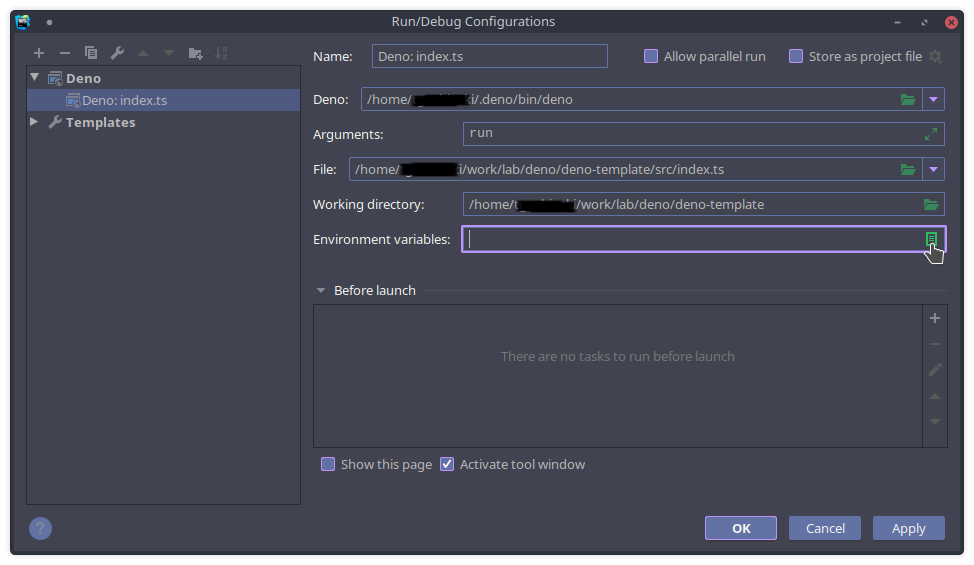

1. For example the `DENO_DIR` is set for per-project caching, plus we can define the port that
 we would like the project to use running in development mode<br />
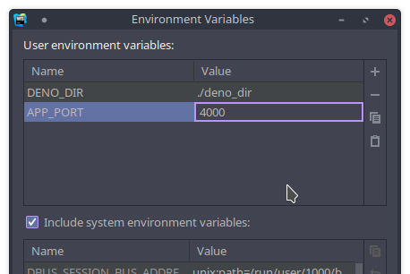

1. Now it is easy to simply duplicate this configuration to create the others<br />
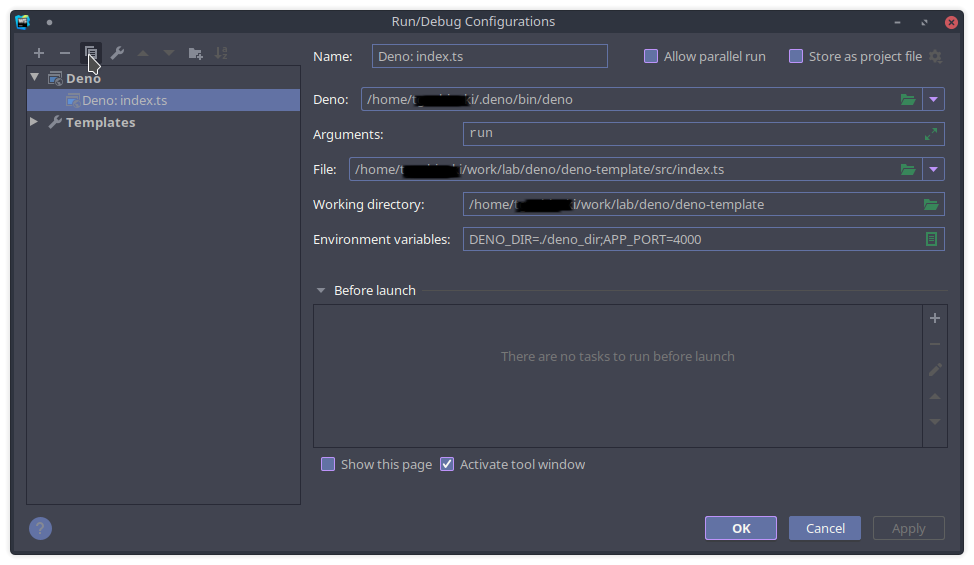

1. Alter the fields **Arguments**, **File**, and **Environment variables** to make a "create/update cache" config<br />
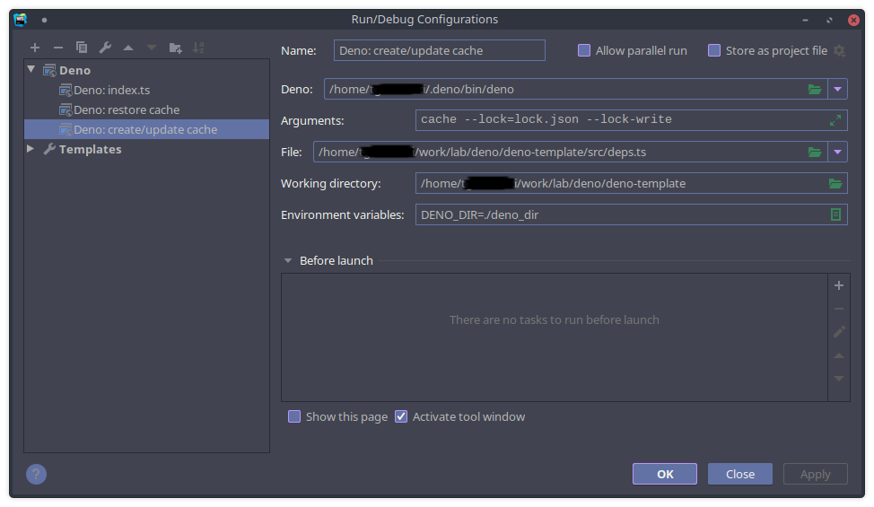

1. Duplicate "create/update cache" and adjust the **Arguments** to make a "restore cache" script

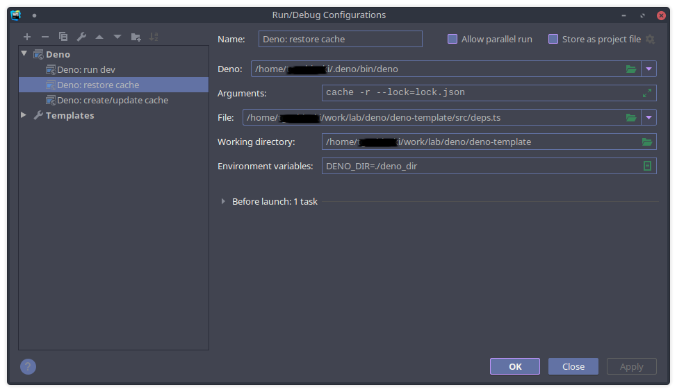

1. Done!

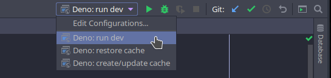


[1]: <https://deno.land/#installation> "Deno Homepage"
[2]: <https://velociraptor.run/> "Velociraptor Script Runner"
